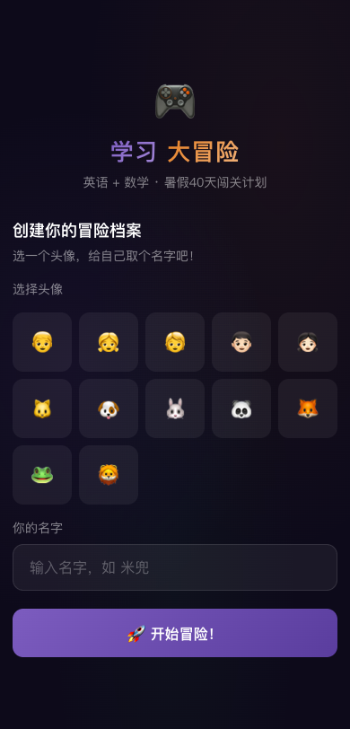

# 学习大冒险 Summer Adventure 🎮

沪教版 5A/5B 英语 + 北师大版五年级数学 · 40天暑假闯关

---

## 🗺️ 项目结构

```
summer-adventure/
├── index.html              ← SPA 入口（登录→首页→选课→闯关）
├── styles.css              ← 深色主题（英语紫/数学橙）
├── js/
│   ├── store.js            ← localStorage 数据层
│   ├── auth.js             ← 登录/用户管理
│   ├── questions.js        ← 40天题库（英语 Day 1-5 有题）
│   ├── speech.js           ← TTS + 语音识别（预留腾讯接口）
│   ├── game-engine.js      ← 游戏引擎（5阶段/31题流程）
│   ├── ranking.js          ← 排名/领奖台
│   ├── dashboard.js        ← 学习进度页
│   ├── main.js             ← SPA 路由 + 页面渲染
│   └── sounds.js           ← Web Audio API 音效
├── assets/                 ← 截图
└── AI出题_Prompt模板.md    ← 用 AI 批量生成题库
```

---

## 🎮 游戏流程

每天 **31 道题**，分 5 个阶段：

| 关卡 | 题数 | 说明 |
|:----:|:----:|:------|
| 📝 词汇闯关 | 12 | 英译中/中译英/选词填空 |
| 🧠 语法迷宫 | 10 | 语法选择/改错 |
| 🎧 听力挑战 | 3 | TTS 播放→选正确答案，自动播，可重听 |
| 🎤 跟读挑战 | 3 | TTS 播放→跟读→Web Speech API 评分 |
| ⚡ Boss 关 | 3 | 综合题，分数翻倍 |

**共同机制：**
- ✅ 倒计时（简单15s / 中等20s / 困难25s / Boss 30s）
- ✅ 积分公式 = 100 × 难度系数 × 速度系数 × 连击系数
- ✅ 答对 / 答错 → 强制展示解析（答错等 8 秒）
- ✅ 全部答完 → 总得分+正确率+阶段明细 → 可重做错题抢分
- ✅ 打卡积分（连续天数越多加成越高，漏一重置）
- ✅ 排名领奖台（第一梯队 10% / 第二梯队 20% / 第三梯队 30%）
- ✅ 星星收集 → 装备兑换（🎩 5⭐ 👓 10⭐ 🦸 15⭐ 👑 25⭐ 🌟 40⭐）

---

## 📊 学习进度

- 英语 + 数学双日历上下排列
- 绿色 ≥80% / 橙色 <80% / 灰色未完成
- 点击已完成天 → 弹窗详情
- 点击未完成天 → 跳转补做，可获积分

---

## 🖼️ 截图

| 登录页 | 首页 | 天选择 | 闯关 | 学习进度 |
|:------:|:----:|:------:|:----:|:--------:|
|  |  |  |  |  |

---

## 🚀 快速开始

```bash
cd summer-adventure
python3 -m http.server 8123
# 浏览器打开 http://127.0.0.1:8123
```

纯前端，零依赖，零构建，localStorage 存数据。

---

## 📖 题库

| 天数 | 英语（沪教版） | 数学（北师大版） |
|:----:|:--------------:|:---------------:|
| Day 1-3 | ✅ 有题 | ⚠️ 少量 |
| Day 4-5 | ✅ 有题 | ❌ 空 |
| Day 6-40 | ❌ 空 | ❌ 空 |

用 `AI出题_Prompt模板.md` 可让 AI 批量生成 JSON 题库。

---

## 🔮 后续计划

- [ ] AI 补全英语 Day 6-40 题库
- [ ] 补全数学题库
- [ ] 替换真实音效文件（鼓掌/惋惜+榔头）
- [ ] 接入腾讯云智聆语音评分 API
- [ ] 转 Uni-app → 微信小程序

## 📄 License

MIT
